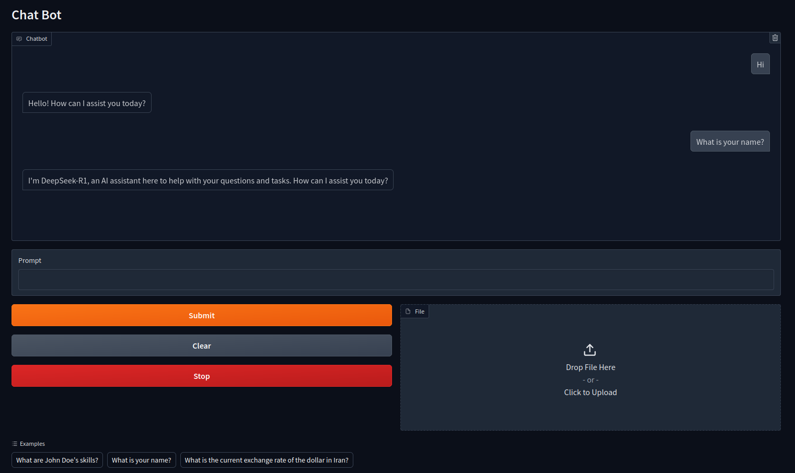

# Agents-Based RAG System with LLM and Tavily Search

## Overview
This project implements an **Agents-based Retrieval-Augmented Generation (RAG) system** using a **Large Language Model (LLM)**, **Tavily Search**, and **FAISS vector storage**. It leverages an AI-powered retriever tool to process documents, extract relevant information, and interact with user queries effectively.

##
</td> 

## Features
- **LLM Integration**: The system utilizes a Large Language Model to generate responses and interact with users intelligently.
- **Retrieval-Augmented Generation (RAG)**: Enhances the quality of generated responses by retrieving relevant context from stored knowledge.
- **Tavily Search API**: Enables real-time web-based retrieval to provide updated and fact-based responses.
- **Agents Framework**: Implements multiple agents for handling different tasks, such as document retrieval, knowledge augmentation, and query response.
- **FAISS Vector Database**: Efficiently indexes and searches documents for relevant content.

## Components
### 1. Large Language Model (LLM)
The system integrates a powerful **LLM** to process user queries and generate responses based on retrieved knowledge.

### 2. Agents Framework
This project is **agent-based**, meaning it consists of multiple specialized agents:
- **Retriever Agent**: Searches for relevant documents using FAISS.
- **Web Search Agent**: Uses Tavily Search API for up-to-date information.
- **Response Generator Agent**: Combines retrieved knowledge with the LLM for enhanced responses.

### 3. Retrieval-Augmented Generation (RAG)
- The system first retrieves relevant context from a **local knowledge base** (documents stored as FAISS vectors) or an **external search engine (Tavily Search)**.
- Then, the LLM generates responses using both retrieved knowledge and its own model capabilities.

### 4. Tavily Search API
- Provides **real-time** web search capabilities to retrieve **fresh information**.
- Ensures the system remains **updated** with the latest facts and knowledge.

